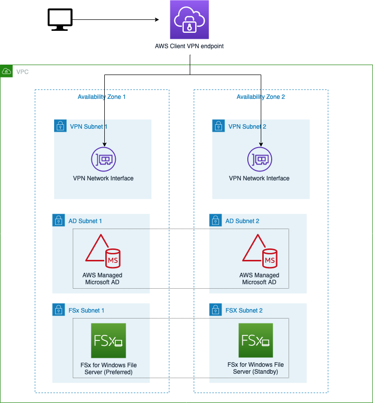
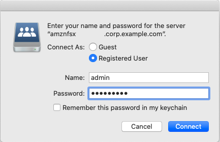

## Access Amazon FSx for Windows through AWS ClientVPN
The purpose of this repository is to demo how a file share hosted in [Amazon FSx for Windows](https://aws.amazon.com/fsx/windows/) can be remote and privately mounted into a client device through an [AWS ClientVPN](https://aws.amazon.com/vpn/client-vpn/) connection. 

The Cloudformation template (main.yaml) deploys an AWS Managed Microsoft AD to allow for authentication and authorization to access the file share, an Amazon FSx file system to host the file shares, and an AWS Client VPN endpoint and gateway to enable remote access. To ensure high availability, the template deploys a VPC with six different subnets and spreads each component over two AWS Availability Zones. 

You can read more in this [blog post](https://aws.amazon.com/blogs/storage/accessing-smb-file-shares-remotely-with-amazon-fsx-for-windows-file-server/)

### Architecture


### Prerequisites
ClientVPN support different authentication types: [Active Directory Authentication](https://docs.aws.amazon.com/vpn/latest/clientvpn-admin/client-authentication.html#ad), [Mutual Authentication](https://docs.aws.amazon.com/vpn/latest/clientvpn-admin/client-authentication.html#mutual), and [Single sign-on (SAML-based federated authentication)](https://docs.aws.amazon.com/vpn/latest/clientvpn-admin/client-authentication.html#mutual) (user-based). For this demo we use Active Directory authentication but, regardless thee type chosen, a server certificate must be provisioned in AWS Certificate Manager.

Follow the steps above to generate the certificate:

1. Clone the OpenVPN easy-rsa repo to your local computer and navigate to the easy-rsa/easyrsa3 folder. 
```
git clone https://github.com/OpenVPN/easy-rsa.git
```
```
cd easy-rsa/easyrsa3
```
2. Initialize a new PKI environment.
```
./easyrsa init-pki
```
3. To build a new certificate authority (CA), run this command and follow the prompts. 
```
./easyrsa build-ca nopass 
```
4. Generate the server certificate and key.
```
./easyrsa build-server-full server nopass
```
5. Upload the server certificate and key to ACM. Be sure to upload them in the same Region in which you intend to create the Client VPN endpoint. 
```
aws acm import-certificate --certificate fileb://pki/issued/server.crt --private-key fileb://pki/private/server.key --certificate-chain fileb://pki/ca.crt
```
6. Save the certificate ARN returned by the previous command. [1]
```
{
    "CertificateArn": "arn:aws:acm:eu-west-1:123456789012:certificate/aaaaaaaa-bbbb-cccc-dddd-eeeeeeeeeeee"
}
```

### Launch the AWS Cloudformation Stack
#### Using AWS Console
Click on the **Launch Stack** button below to launch the CloudFormation Stack to set up the Amazon FSx file system demo in the region of your preference, by default this demo will be deployed in eu-west-1 (Ireland) region.

[](https://eu-west-1.console.aws.amazon.com/cloudformation/home?region=eu-west-1#/stacks/quickcreate?templateUrl=https%3A%2F%2Ffsx-through-clientvpn.s3.eu-west-1.amazonaws.com%2Fmain.yaml&stackName=fsx-through-clientvpn)

Parameters **required** to provide:
* Stack name: e.g. **fsx-through-clientvpn**.
* VPN Server Certificate Arn: use <CertificateArn> value retrieved from [1].
* AD Password: Set a password for your admin user of the AD. Make sure your password complies with [AWS Managed Microsoft AD password requirements](https://docs.aws.amazon.com/directoryservice/latest/admin-guide/ms_ad_getting_started_create_directory.html).

#### Using AWS CLI
You can launch the same stack using the AWS CLI. Here's an example:

```
aws cloudformation create-stack --stack-name fsx-through-clientvpn \
   --template-body file://main.yaml \
   --capabilities CAPABILITY_NAMED_IAM \
   --region eu-west-1 \
   --parameters  ParameterKey=VPNServerCertArn,ParameterValue=<CertificateArn>ParameterKey=ADPassword,ParameterValue=<YOUR_AD_PASSWORD>

```

### How to mount and access to your file system
1. Download AWS Client VPN for your OS [here](https://aws.amazon.com/vpn/client-vpn-download/).
2. Retrieve ClientVPN endpoint ID. This value can be found on the "Outputs" tab of your stack. Another way of accessing via CLI:
```
aws cloudformation describe-stacks --stack-name fsx-through-clientvpn \
   --query "Stacks[0].Outputs[0].OutputValue" \
   --region eu-west-1
```

3. Download client configuration file. 
```
  aws ec2 export-client-vpn-client-configuration \
  --client-vpn-endpoint-id <CLIENT_ENDPOINT_ID>  \
  --output text --region eu-west-1 >> client-config.ovpn
```

4. Open AWS Client VPN, add a new profile and select the config file you just downloaded.
5. Connect to the created profile. Enter your user name (admin) and password (<YOUR_AD_PASSWORD>), and click okay to connect.
6. Retrieve the FSx DNS Name. This value can be found on the "Outputs" tab of your stack. Another way of accessing via CLI:
```
aws cloudformation describe-stacks --stack-name fsx-through-clientvpn \
   --query "Stacks[0].Outputs[1].OutputValue" \
   --region eu-west-1
```

7. Mounting Amazon FSx file share
The following steps show you how to mount your Amazon FSx file share on macOS.

*macOS*

Open a new Finder window. In the status bar, click on Go then Connect to server.



In the connection window, enter smb://<Amazon FSx DNS URL>/share. When prompted, enter your administrator credentials.

###  Clean up

After completing your demo, delete AWS CloudFormation Stack using AWS Console or AWS CLI:
```
aws cloudformation delete-stack --stack-name fsx-through-clientvpn --region eu-west-1
```
````
aws acm delete-certificate \
   --certificate-arn arn:aws:acm:eu-west-1:123456789012:certificate/aaaaaaaa-bbbb-cccc-dddd-eeeeeeeeeeee \
   --region eu-west-1
````

## Security

See [CONTRIBUTING](CONTRIBUTING.md#security-issue-notifications) for more information.

## License


This library is licensed under the MIT-0 License. See the LICENSE file.

## Authors
- Carmen Pino Cuevas
- Serhat Gulbetekin

